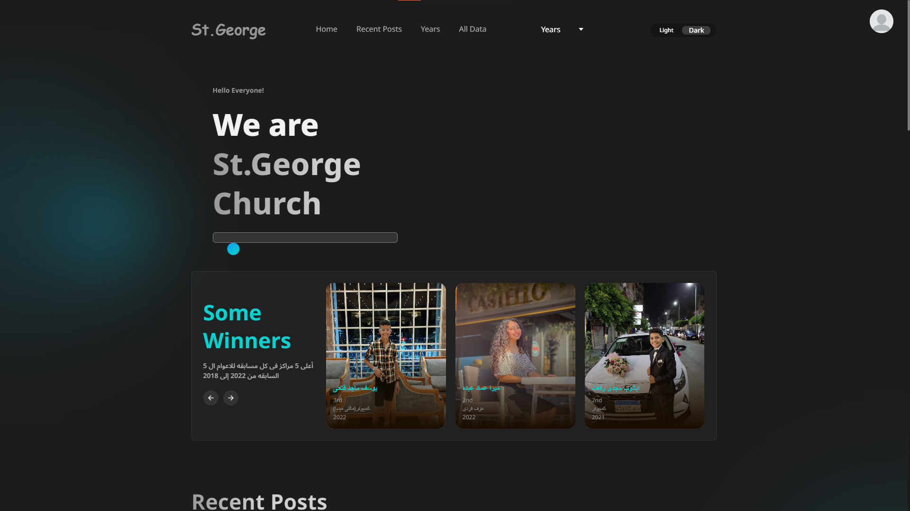
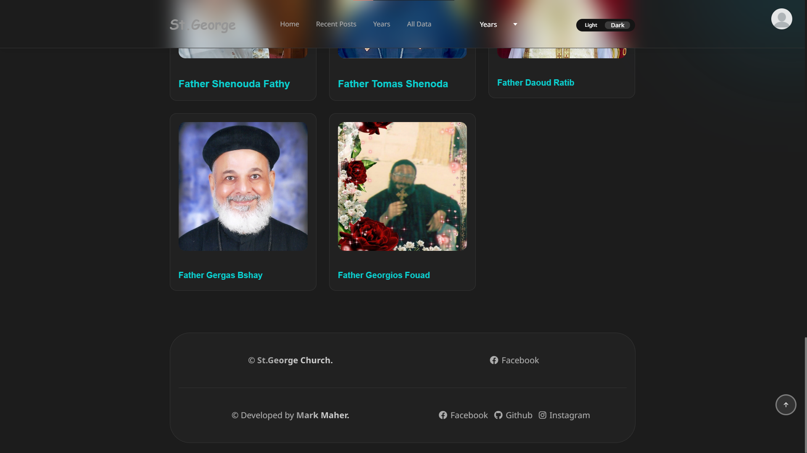
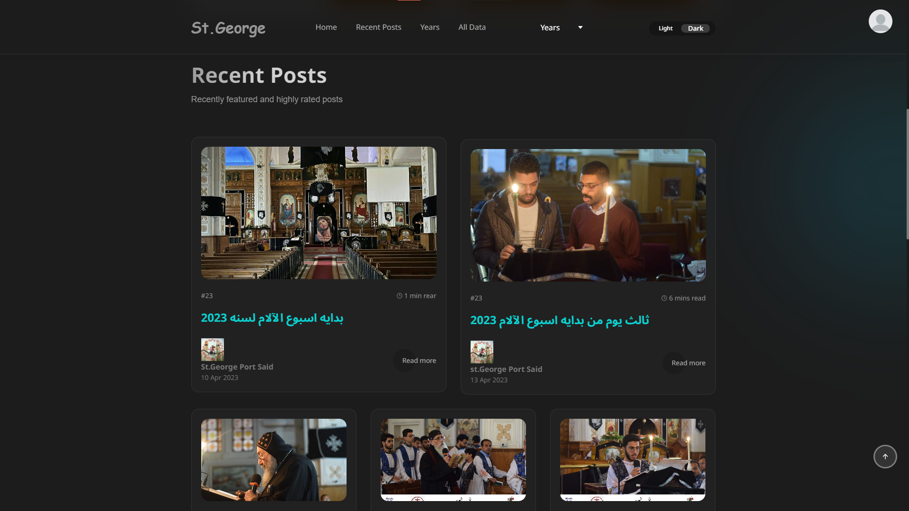
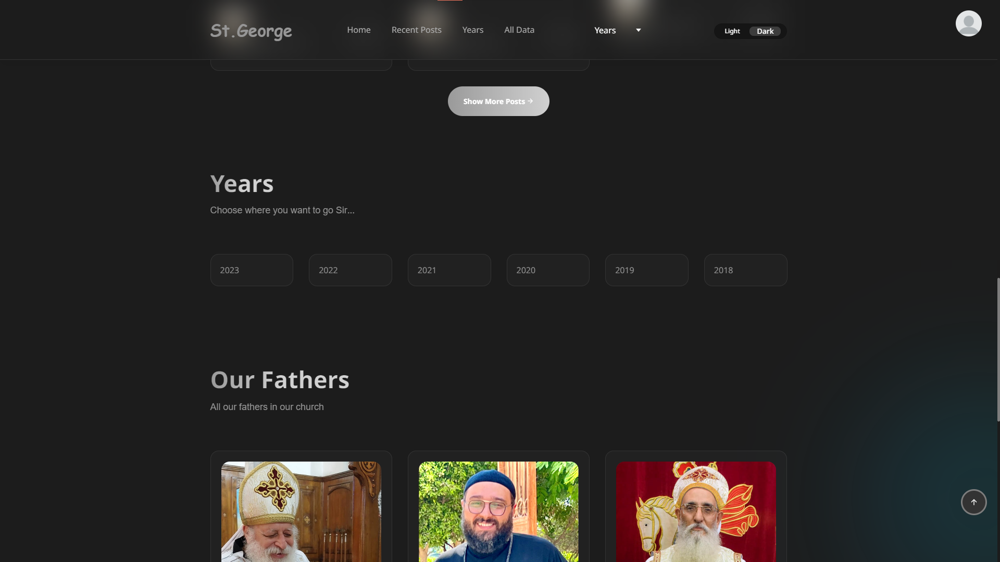
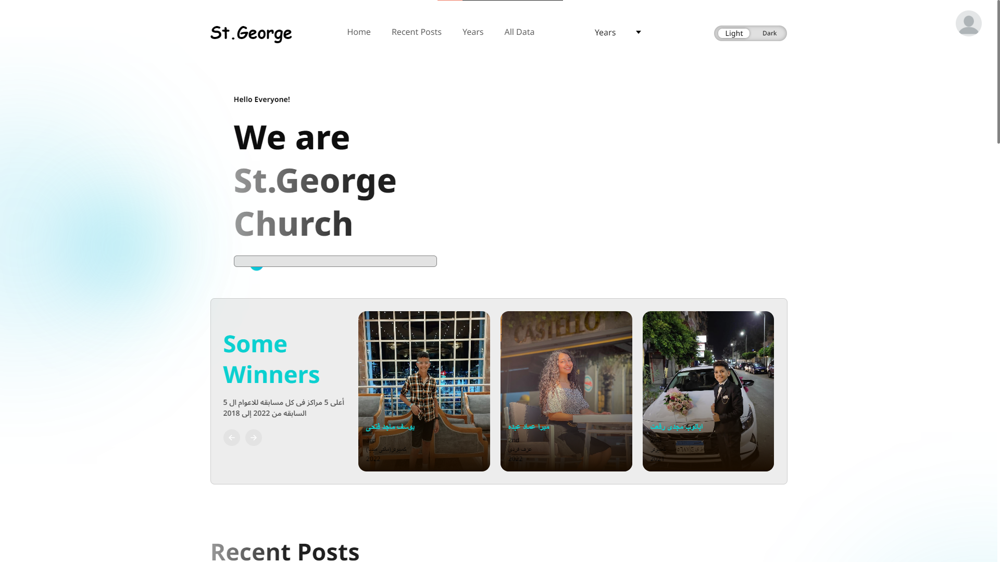

# St.George Church Webiste

- St.George Church Website for every member who joined the El-Keraza Competition with this church
- contains everything about the members of this church who joined some yearly competitions like electronics, chess, art, ...etc

## Skills

i used in this web app

<ul>
<li style="list-style: number;">
    HTML5
</li>
<li style="list-style: number;">
    CSS3
</li>
<li style="list-style: number;">
    JS
</li>
<li style="list-style: number;">
    NodeJS
</li>
<li style="list-style: number;">
    ExpressJS
</li>
<li style="list-style: number;">
    EJS
</li>
<li style="list-style: number;">
    JSON (like a DB)
</li>
<li style="list-style: number;">
    nodemon
</li>
</ul>

## How to run? 

1- First you need to install `node_modules` by this command `npm i `  
2- run `npm run start` to start the project  

`don't worry the dashboard is connect to everything and it can edit, add, delete, ...etc`

you can now open the website on `http://localhost:${PORT}` 

# Important ! 

remember to add `.env` file and add this values

- PORT

# Some pics for the website

  

# &copy; Developed by Mark Maher Ewida
